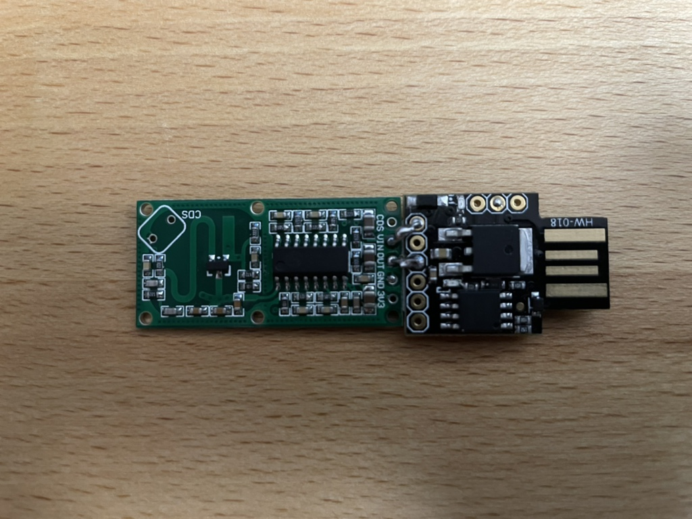
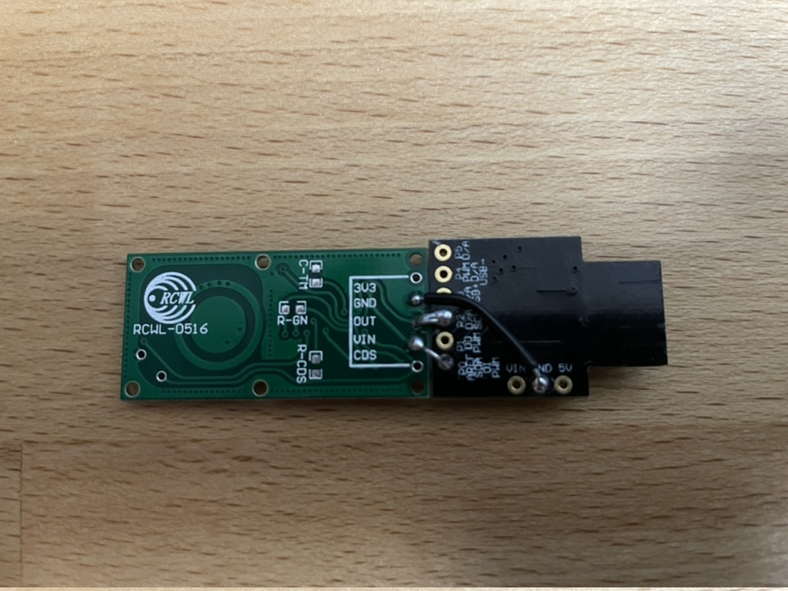

# digisparkradar

## Hardware

Digispark, powered by good ol' ATTiny85.

RCWL-0516 Doppler radar sensor. Low cost but sensitive.

They can be nicely assembled side by side to form a stable single module that fits into a USB-A socket. See the photos.

## Features

The RCWL needs a few seconds to start and adjust sensitivity. The Digispark will flash the onboard LED while the serial port is already open.

When motion is detected, the on board LED lights up and the Digispark is ready to send the result via serial port ttyACM as 1 (motion) or 0 (no motion). The RCWL keeps the motion status for a few seconds. The hold time is retriggered with new motion.

The PC needs to poll the status by sending one byte, to receive one byte. This is required as DigiCDC sets a (too) small output buffer and allows no custom settings. See radar.py for an example.

## Build

Make sure you have the Digispark board infos available, I'm using the [Additional Boards Manager URL from Digistump](http://digistump.com/package_digistump_index.json).

Load the ino into the Arduino IDE, set the device accordingly, compile and upload, then connect or powercycle the Digispark.

## Copy

Absolutely, just do according to the license, it's Open Source! Please reference me and don't forget to share your work, too.

## Pictures

Upside

Downside

## Issues

None.

## Todo

CAD and 3d-print a nice case.
